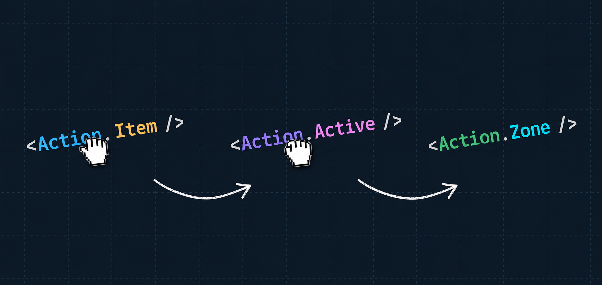

<p align="center">
  
</p>

# drop-action

Zero-dependency, headless drag-and-drop primitives for React.

[](https://www.npmjs.com/package/drop-action)
[](https://github.com/desko27/drop-action/actions/workflows/ci.yml)
[](#license)

> **Status:** pre-1.0 and in active development. The API surface is stabilising toward `1.0.0`; expect breaking changes between minor versions until then.

## About

`drop-action` is a small, headless drag-and-drop toolkit for React. You call `createDropAction()` and get back a self-contained namespace of components and hooks (`Item`, `Zone`, `Active`, `useOver`, …) whose surface mirrors a dnd-kit-style API — but built on a custom Pointer Events engine with **no runtime dependencies** and **no Provider to wrap your tree in**.

Headless means it ships behaviour, not looks: it tracks the drag, decides which zone is under the pointer, and tells you how a drop resolved — you render every pixel. Drops resolve through an explicit, optionally-async verdict — a zone calls `accept()` or `reject()` — so it can `await` a network call before deciding.

## Features

- **Zero runtime dependencies** — only React itself (peer dep, `>=18`).
- **Tiny and tree-shakeable** — size-budgeted core (≤ 4.75 KB min+brotli); opt-in extras live behind subpaths so you only pay for what you import.
- **No Provider** — `createDropAction()` closes over its own store; just render the components it returns ([ADR-0002](docs/adr/0002-closure-scoped-store-no-provider.md)).
- **Fast Refresh-friendly** — the factory returns a component, so a shared `export const DnD = createDropAction()` module hot-reloads with a scoped remount instead of a full page reload in Next.js / Vite ([ADR-0015](docs/adr/0015-create-drop-action-returns-channel-component.md)).
- **Headless** — no styles, no DOM you didn't ask for. Hooks are the primitive (spread `ref` + props onto your own `<tr>`/`<li>` for a zero-extra-node layout); the components are thin sugar with an `as` prop ([ADR-0008](docs/adr/0008-hook-primitive-component-sugar-aschild.md)).
- **Explicit, async-capable drops** — a zone decides via `{ accept, reject }`; accept is opt-in (`accept()`), `reject()` is the self-documenting decline, and a zone may `await` before deciding ([ADR-0003](docs/adr/0003-async-drop-resolution-explicit-accept.md), [ADR-0014](docs/adr/0014-single-explicit-drop-verdict-per-zone.md)).
- **Pointer Events engine** — one code path for mouse, pen and touch, with pointer-type-aware activation so taps, clicks and scrolls aren't hijacked ([ADR-0001](docs/adr/0001-pointer-events-drag-engine.md), [ADR-0012](docs/adr/0012-activation-constraint-per-action-pointer-aware.md)).
- **Pluggable collision detection** — `rectIntersection` (default), `pointerWithin`, `closestCenter`, or your own.
- **Composable modifiers** — `restrictToWindowEdges` (default), axis locks, `snapToGrid(size)`, or your own; the modifier pipeline drives both the overlay and collision ([ADR-0007](docs/adr/0007-modifiers-pipeline-drives-collision.md)).
- **Flexible drag handles** — the whole item by default, or a custom handle that can live anywhere in the tree ([ADR-0009](docs/adr/0009-drag-handles-no-registry.md)).
- **Smart grab anchor** — the overlay hangs from the pointer where you grabbed it; the `proportional` default keeps the same fractional grip even when the overlay is a different size from the source, so the pointer never "grabs the void" (configurable per action or per item; [ADR-0021](docs/adr/0021-grab-anchor-engine-config-proportional-default.md)).
- **TypeScript-first** — generic over your item `data`; the dragged `{ id, data }` is typed end to end.
- **SSR-safe** — inert on the server, no DOM access until a drag begins.
- **Spring-loading** — `useHover` / `useDwell` detect the drag dwelling over any element (hover-to-expand folders), even though pointer capture kills DOM hover mid-drag ([ADR-0024](docs/adr/0024-hover-targets-and-core-dwell.md)).
- **Opt-in extras as Extensions** — snap-back (`drop-action/snap-back`) and edge auto-scroll (`drop-action/auto-scroll`) ship as tree-shakeable modules you inject under the namespace with `.extend()` ([ADR-0004](docs/adr/0004-headless-core-optional-subpath-modules.md), [ADR-0025](docs/adr/0025-extensions-namespace-injection.md), [ADR-0033](docs/adr/0033-auto-scroll-extension-via-drag-time-hook-seam.md)).

## Installation

```bash
npm install drop-action
# or: pnpm add drop-action
# or: yarn add drop-action
```

### Requirements

- React `>=18` and React DOM `>=18` (peer dependencies)

## Usage

A draggable item, a zone that accepts it, and the overlay that travels with the pointer:

```tsx
import { createDropAction } from 'drop-action'

type Card = { label: string }

// One self-contained drag-and-drop channel. No Provider needed.
const DnD = createDropAction<Card>()

function Board() {
  return (
    <>
      {/* The source item stays put; an overlay travels instead. */}
      <DnD.Item
        id="card-1"
        data={{ label: 'Drag me' }}
        onAccept={(item) => console.log('accepted', item.id)}
        onReject={(item) => console.log('rejected', item.id)}
      >
        Drag me
      </DnD.Item>

      {/* A zone decides each drop via { accept, reject }. Calling accept()
          accepts; anything else (including never responding) is a reject. */}
      <DnD.Zone id="inbox" onDrop={(item, { accept }) => accept()}>
        Drop here
      </DnD.Zone>

      {/* The overlay: portalled to the body, follows the pointer. */}
      <DnD.Active>
        {({ data }) => <div className="overlay">{data.label}</div>}
      </DnD.Active>
    </>
  )
}
```

### Highlighting the active zone

`useOver(zoneId)` returns the dragged `{ id, data }` while that zone is the one under the pointer — truthy for exactly one zone at a time:

```tsx
function Inbox() {
  const over = DnD.useOver('inbox')
  return (
    <DnD.Zone
      id="inbox"
      onDrop={(_item, { accept }) => accept()}
      className={over ? 'zone zone--over' : 'zone'}
    >
      Drop here
    </DnD.Zone>
  )
}
```

### Async accept / reject

A zone decides through `{ accept, reject }`. It can `await` before deciding; `reject()` reads as an explicit decline (e.g. a guard clause), and returning without a verdict — including never responding — is still a reject:

```tsx
<DnD.Zone
  id="inbox"
  onDrop={async (item, { accept, reject }) => {
    const ok = await saveOnServer(item.data)
    if (ok) accept()
    else reject() // explicit decline — or just return; a no-op is a reject too
  }}
>
  Drop here
</DnD.Zone>
```

Each verdict can carry a payload to the item — `accept(payload)` / `reject(payload)` flow to the item's `onAccept` / `onReject`, typed via `createDropAction<Data, Accept, Reject>`.

### Snap-back (opt-in Extension)

The core is unopinionated about animation. `drop-action/snap-back` eases the overlay back to its origin on any **return** (a reject, a no-drop, or a cancel — every ending except an accept). It ships as an **Extension**: inject it with `.extend()` to get `DnD.ActiveSnapBack` / `DnD.useActiveSnapBack` under the namespace:

```tsx
import { createDropAction } from 'drop-action'
import { snapBack } from 'drop-action/snap-back'

const DnD = createDropAction<Card>().extend(snapBack<Card>())

// Use <DnD.ActiveSnapBack> in place of <DnD.Active>: it renders the overlay while
// dragging AND keeps a ghost mounted that animates home on a return.
<DnD.ActiveSnapBack>{({ data }) => <div className="overlay">{data.label}</div>}</DnD.ActiveSnapBack>
```

`.extend(...)` takes one or more Extensions and merges their members under the channel; it is a method (not a second `createDropAction` argument) so the Extension types stay inferred even when you fix `Data` explicitly. To apply one by hand instead, call it: `const { ActiveSnapBack } = snapBack<Card>()(DnD)`.

### Auto-scroll (opt-in Extension)

`drop-action/auto-scroll` is dnd-kit-style edge-proximity scrolling: while a drag's pointer sits in a band near a scroll container's edge, that container scrolls continuously, faster the deeper into the band — innermost scroller first, the window as the outermost, falling through to the next outer one when the inner hits its limit. Enabling it is `.extend(autoScroll())` and **nothing else** — it injects no namespace members and you mount nothing:

```tsx
import { createDropAction } from 'drop-action'
import { autoScroll } from 'drop-action/auto-scroll'

const DnD = createDropAction<Card>().extend(autoScroll<Card>())

// Render <DnD.Active> as usual — auto-scroll just runs during drags.
```

Tune it per Drop Action: `threshold` (band size as a fraction of the scroller per axis, default `0.2`), `speed` (max px/s, default `1500`), `acceleration` (depth→speed exponent, default `1` = linear). To disable it, drop the extension. Scroll containers are discovered automatically (any `overflow: scroll/auto` ancestor the pointer is inside, plus the window), so there is nothing to register ([ADR-0033](docs/adr/0033-auto-scroll-extension-via-drag-time-hook-seam.md)).

### Spring-loading (hover & dwell)

During a drag, `setPointerCapture` makes the source own the pointer, so other elements never get DOM `hover`. The engine is then the only reliable source of "the cursor is over element X" — so hover/dwell live in the core. `useHover(id)` reports it; `useDwell(id, { onDwell })` fires once the cursor **settles** over the element for `dwellMs` (staying within `tolerance` px) — the building block for spring-loaded folders that expand on drag-over:

```tsx
function NodeHeader({ id }: { id: string }) {
  const [open, setOpen] = useState(false)
  const { ref, isDwelling } = DnD.useDwell(id, {
    onDwell: () => setOpen(true), // expand after the drag dwells ~500ms
    dwellMs: 500,                 // default
    tolerance: 8,                 // settle radius in px; default
  })
  return <div ref={ref} data-dwelling={isDwelling || undefined} />
}
```

A hover target is **observe-only** — a drop never lands on it and it never affects drop resolution, so it can freely overlap a zone. Reach for `useHover` when you want the raw "is the drag over me" signal (tab-switch on drag-over, custom highlights) and `useDwell` when you want it timed. (Edge auto-scroll is its own thing — see the `drop-action/auto-scroll` Extension above — not a hover/dwell use.)

### Grab anchor

Where the travelling overlay hangs from the pointer. By default (`'proportional'`) the overlay holds the same *fractional* grip the press had on the source — identical to a fixed pixel offset when the overlay matches the source, and free of "grabbing the void" when the overlay is smaller. Pin a fixed point instead (e.g. `center`), keep the source-absolute pixel offset (`'preserve'`), or compute one per drag with a function. Set it once per action, or override a single item:

```tsx
import { createDropAction, center } from 'drop-action'

// Every overlay hangs from its centre…
const DnD = createDropAction<Card>({ grabAnchor: center })

// …or override just one item back to the source-absolute offset:
<DnD.Item id="card-1" data={{ label: 'Drag me' }} grabAnchor="preserve">
  Drag me
</DnD.Item>
```

### Configuration

Pass options to `createDropAction`:

```tsx
import { createDropAction, closestCenter, snapToGrid } from 'drop-action'

const DnD = createDropAction<Card>({
  collisionDetection: closestCenter,
  modifiers: [snapToGrid(20)],
  activationConstraint: {
    mouse: { distance: 5 },              // drag after moving 5px
    touch: { delay: 200, tolerance: 8 }, // press-and-hold to drag; swipe to scroll
  },
})
```

| Option | Default | Description |
|--------|---------|-------------|
| `collisionDetection` | `rectIntersection` | Strategy that picks which zone is *over*. Also: `pointerWithin`, `closestCenter`, or your own `CollisionDetection`. |
| `modifiers` | `[restrictToWindowEdges]` | Pipeline that adjusts the overlay transform. Also: `restrictToVerticalAxis`, `restrictToHorizontalAxis`, `snapToGrid(size)`, or your own `Modifier`. |
| `activationConstraint` | pointer-type-aware | Movement distance / press delay a pointer must cross to start a drag. |
| `shouldStart` | `defaultShouldStart` | Eligibility guard on the initial press: whether it may become a drag at all. The default refuses presses on interactive content (form controls, editable text) and non-primary buttons. |
| `grabAnchor` | `'proportional'` | Where the overlay hangs from the pointer. Also: `'preserve'`, a fixed point (e.g. `center`), or a function. Overridable per item. |
| `grabCursor` | `true` | Show the `grab` / `grabbing` cursor affordance. Set `false` to take full control of the cursor yourself. |
| `measure` | DOM `getBoundingClientRect` | Override how item/zone geometry is read (useful for tests and non-DOM strategies). |

## API

`createDropAction<Data>(options?)` returns the **Drop Action** — a channel component carrying the members below; reach for them with dot-notation (`DnD.Zone`, `DnD.useOver`, …) and don't render the Drop Action itself ([ADR-0015](docs/adr/0015-create-drop-action-returns-channel-component.md)). Two optional generics — `createDropAction<Data, Accept, Reject>` — type the `accept` / `reject` payloads; both default to `void`. Inject opt-in **Extensions** (e.g. snap-back) with `.extend(...)` ([ADR-0025](docs/adr/0025-extensions-namespace-injection.md)).

| Member | Kind | Purpose |
|--------|------|---------|
| `Item` | component | A draggable element carrying typed `data` (sugar over `useItem`). Reacts to a drop verdict via `onAccept` / `onReject`. |
| `Zone` | component | A droppable target deciding each drop through `onDrop(item, { accept, reject })` (sugar over `useZone`). |
| `Active` | component | The overlay; renders the dragged item in flight via a portal. |
| `useItem(id, data, opts?)` | hook | Register a draggable; returns `{ ref, dragHandleProps, isDragging }`. |
| `useZone(id, opts?)` | hook | Register a droppable; returns `{ ref }`. |
| `useDragHandle(id)` | hook | Props for a custom handle that can live outside the item's subtree. |
| `useActive()` | hook | The item currently in flight (`{ id, data, status, … }`) or `null`. |
| `useOver(zoneId)` | hook | The dragged `{ id, data }` while `zoneId` is *over*, else `null`. |
| `useHover(id)` | hook | Register an observe-only hover target; returns `{ ref, isHovering }` (true while the drag's cursor is over it). A drop never lands here. |
| `useDwell(id, opts)` | hook | Spring-load timing over a hover target: `onDwell` fires once the cursor settles for `dwellMs`. Returns `{ ref, isDwelling }`. |
| `useResolution()` | hook | How the last drag ended (`accepted` / `rejected` / `no-drop` / `cancelled`), kept until the next drag. |
| `extend(...exts)` | method | Inject Extensions (e.g. `snapBack()`) under the namespace, returning the channel widened with their members. |

A drag ends in exactly one terminal **outcome**: `accepted`, `rejected`, `no-drop`, or `cancelled`. The three non-accept endings form a **return** (what snap-back animates). See [`CONTEXT.md`](CONTEXT.md) for the full glossary.

## Documentation

- [`CONTEXT.md`](CONTEXT.md) — the domain glossary (Item, Zone, Active, Over, Return, …).
- [`docs/adr/`](docs/adr/) — architectural decision records explaining the *why* behind the design.

## Development

This is a pnpm monorepo. The published package lives in [`packages/drop-action`](packages/drop-action); a live demo lives in [`sites/demo`](sites/demo).

```bash
pnpm install      # install workspace deps
pnpm dev          # run the demo app (sites/demo)
pnpm test         # run the unit tests
pnpm build        # build the package
pnpm lint         # lint with Biome
pnpm check:types  # type-check the workspace
pnpm size         # check the bundle-size budgets
```

## Contributing

Contributions are welcome. Issues and PRDs are tracked as [GitHub issues on `desko27/drop-action`](https://github.com/desko27/drop-action/issues). Before working in an area, skim [`CONTEXT.md`](CONTEXT.md) for the shared vocabulary and the relevant [ADRs](docs/adr/) — the project keeps a deliberate, documented domain language, and changes are expected to fit it.

## Acknowledgments

- Public API surface inspired by [dnd-kit](https://github.com/clauderic/dnd-kit).
- The factory + opt-in subpath-module pattern follows [react-call](https://github.com/desko27/react-call).

## License

[MIT](https://opensource.org/licenses/MIT) © [Ismael Ramon](https://desko.dev)
